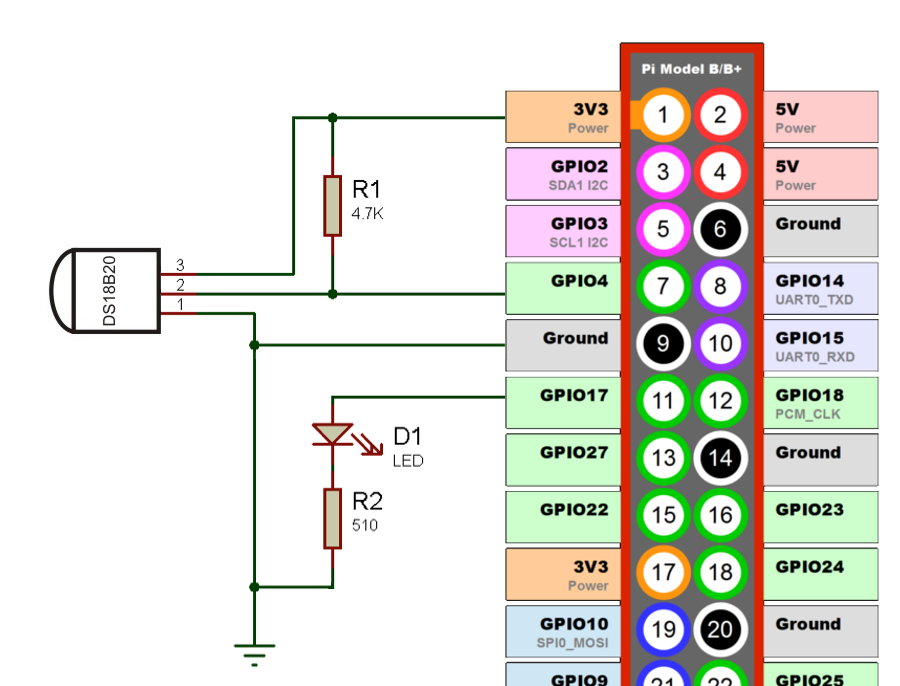

此处将对IoT的各种云平台进行对比和分析。

Platform | Data store | Services integration | Data visualization | SDK API | Event/rule mngt | Free account
--- | --- | --- | --- | --- | --- | ---
Temboo | No | Yes (about 2000 choreos) | No | Yes | Yes | Yes
Carriots | Yes | Yes(Email, SMS, Twitter) | No | Yes | Yes | Yes
NearBus\*	| No	| No	| No	| Yes	| Yes	| Yes
**_Ubidots_**	| Yes	| Yes(Email, SMS, Twitter, Webservvice)	| Yes	| Yes	| Yes\*\*	| Yes

IoT平台将来将成为一个竞争核心，那么到底什么是IoT平台？

###### 首先来看看一个完整的IoT生态体系是什么样的

1. 硬件，例如感应器或者摄像头，这些硬件从外部环境收集相关数据；
1. 连接，所有的硬件需要通过某种途径相互连接以传达信息；
1. 软件，部署在云端的软件，收集、处理、并发送相应信息；
1. 用户界面，用户通过界面来控制这整个系统；

而IoT平台就是上面提到的软件。

###### IoT平台的主要功能在于：

1. 连接所有硬件；
1. 处理各种通讯协议；
1. 提供安全以及认证功能；
1. 收集、分析、处理及可视化数据；
1. 集成其他页面服务；

###### 什么情况下需要用到IoT平台？

当你没有足够的资金和技术团队去自己创建一套可以处理IoT系统的软件的时候，你可以考虑使用IoT平台；

然而，长期的付费却会是一个让人头疼的事情，你需要考量的仅仅是时间和金钱之间的关系。

###### 以DeviceHive这个IoT云平台为例子

这里记录一下如何安装远程控制温度感应器和LED。所需材料如下：

* Raspberry Pi 1 Model B, 2, 3
* DS18B20感应器
* LED
* 510ohm电阻（给LED）和4.7k ohm电阻（给DS18B20）
* 电路板

