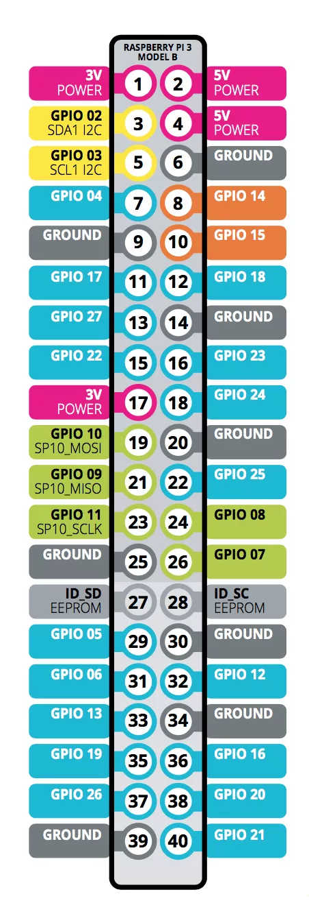

## Raspberry Pi 3 GPIO pin的全面解说

GPIO是General-Purpose Input/Output（通用输入/输出）的缩写，用户可以通过编程这些针来使其与现实世界相互作用。
下图为对于各类针在颜色上进行归类，这样比较清楚的可以看见所有的针是那一类针

颜色分类 | 详图
---|---
 | 

#### 电源针

电源针可以给其他连接到该针的设备提供电源（针2和针4，5V）sensors

#### GROUND针（GND）

接地针（基础电学中的接地线的作用是一样的）

#### GPIO针

图中茫茫多的GPIO针就是用来开关设备用的。

#### 接口

类似传感器和微型控制器这些外接设备需要通过这些接口来进行实现相互通讯的。

#### UART针

UART是Universal Asynchronous Receiver/Transmitter的缩写（通用异步收发传输器)，串行通信是通过通信通道或计算机总线一次一位地发送数据的过程。在Raspbian系统中，UART默认是用来连接它的终端的，当你想要用你的PC连接Raspberry Pi终端，却发现不能通过SSH去连接的时候，这个UART就发挥它的作用了。它的传输速度为115.2kbps，看起来有点慢，却足够使用了。

#### SPI针

SPI是Serial Peripheral Interface的缩写（串行外接接口），主要用于外接设备。由于每个SPI外接设备所需要最少的连接数为4 - 3根用于传送、接收和同步数据，1跟在控制多设备时用作ID，所以基本上，也就顶多只能连接2各SPI外接设备。

#### I2C针

I2C是Inter-Integrated Circuit的缩写（集成电路总线），它只需要2跟连接（针3和针5），但是它只适用于低速传送的外接设备，其他的还是需要用SPI外接设备比较合适。
It is also appropriate to note that when the Raspberry Pi 3 is in halt or shutdown mode, you can “wake” it up by shorting pin 5 to ground.

#### EEPROM针

EEPROM是Electrically Erasable Programmable read only memory的缩写（电可擦可编程只读存储器），基本上意味着你不会用到这类针。
